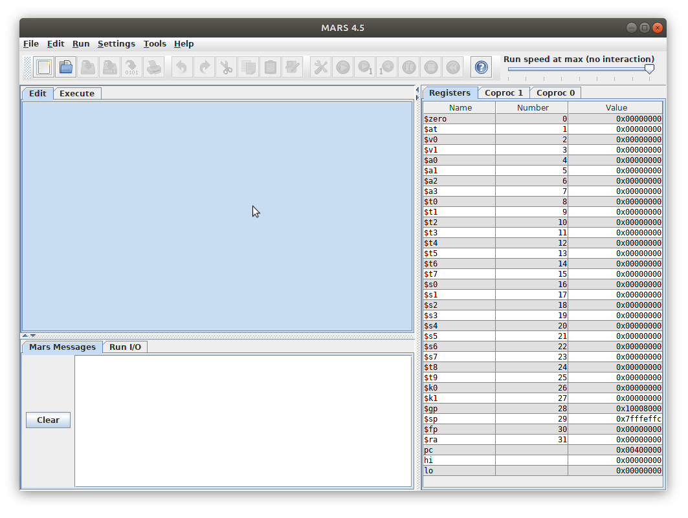

# Arquitectura de Ordenadores

# Práctica 1

Voy a empezar a hacer la práctica 1. A ver qué pasa....

Arrncamos el simulador con:

```
$ java -jar Mars4_5.jar
```

Nos aparece esto:




Y el terminal donde se ha lanzado java está limpio (no sale ningún warning, ni error, ni avisos ni nada....)

## Segmento de texto

El programa en ensamblador que nos piden inicialmente es el siguiente:

```asm
.data
str:
.asciiz "Hola Mundo en MIPS32\n"
.text
main: la $a0, str
li $v0, 4
syscall
li $v0, 10
syscall
```

Nos piden que lo carguemos en el simulador...  Perfecto. Con File/Oen/prog1.asm lo he cargado. Tiene resaltado de sintáxis y todo... Mola!!!

se ensambla con el botón de la herramienta... y aparece el código máquina en la pestaña Execute. ¡Mola!!!...

Lo primero que veo es que la instrucción la (load address??) y li (load inmediate?) se han convertido a otras (igual que el RISV-v)

Nos piden:

1. Longitud instruccciones?  4 bytes
2. Dirección de la segunda instrucción? 0x00400004
3. Little endian... Primero lo menos significativo, luego lo más
4. No entiendo bien.... Claro que debe ser correcta jajajaj
5. Clasificar... Tengo que aprender los tipos I, R o J
6. Modos de direccionamiento....


## Miércoles, 26-Sep-2018

Preparación clases de Arquitectura. Resolución del guión de prácticas 1

### Parte A

1. Como se puede ver en la columna CODE de la pestaña Execute, las instrucciones del MIPS son de 32 bits (4 bytes)

2. La dirección donde está almacenada cada instrucción se muestra en la columna Address. La primera instrucción se encuentra en la dirección 0x00400000 y la segunda en la 0x00400004

3. Se utiliza little-endian: Los bits menos significativos de una palabra se almacenan en la dirección más baja. Nos fijamos en la primera instrucción: lui, que en hexadecimal es 0x3c011001. Ahora nos vamos a la parte inferior de mars, donde pone Data Segment y vamos a visualizar el segmento de código (text): Vemos que en la primera dirección: 0x00400000 la palabra que hay almacenada es 0x3c011001. Es decir, que en 0x00400000 hay almacenado un 01, en 0x00400001 hay un 10, en ..2 un 11 y en 3 un 3c

4. En la página A-57 del manual (hennesy y paterson) vemos el formato de la instrucción. Los primeros 6 bits son del opcode: 001111 (0xf), los siguientes 5 son 0 (00000), los siguientes son el registro destino (que es 1: 00001) y por último el valor inmediate de 16 bits, que es 0x1001: La instrucción en binario es:
 -
    001111 00000 00001 0x1001

    Pasando todo a hexadecimal tenemos:  0x3c011001

    Que es justamente la instrucción que está almacenada en la primera dirección (0x00400000)

  * Repetimos para el resto de instrucciones.   Ori $4, $1, 0x00000007

         Opcode: 0xd
         rs: $1: 00001
         rt: $4: 00100
         imm: 0x0007

         La instrucción es: 0x34240007

  * addiu $2, $0, 0x00000004

     op: 001001
     rs: 00000
     rt: 00010
     imm: 0x0004

     Código máquina: 0x24020004

   * syscall: 0x0000000c
   * addiu $2, $0, 0x0000000a:   0x2402000a


5. En la página 4 del manual del mars (de katia), está un resumen con el tipo de instrucciones:

     lui $1, 0x00001001  -> I
     ori $4, $1, 0x00000007 -> I
     addiu $2, $0, 0x04  -> I
     syscall (??. Yo apostaria tipo J....)

6. Todas usan direccionamiento inmediato

### Parte B: Segmento de datos

1. Las direcciones de memoria, para los datos, son de 32 bits (4 bytes)
2. Observando la ventana de labels, vemos que la etiqueta str se correspoinde con la dirección 0x10010000
3. La ordenadión es little endian: La letra "H" está en la dirección más baja: 0x10010000
4. En esta pregunta hay ambiguedad. No tengo claro si str se está refiriendo al puntero o a la variable completa. En realidad la variable es un string (array). Yo creo que se refiere a esto. Así que mi respuesta es:  Ocupa 22 bytes. Que son 6 palabras:

### Parte C: Más tipos de datos

1. bytes: 20 bytes. Exactamente 5 palabras
2. Ocupa 3 palabras. 11 bytes. Me recuerda a un array


### Almacenamiento de bytes

easy...

### Arrays y carga de memoria a registro

Este programa recorre el array definido al comienzo, de 4 elementos y sus elementos los guarda en los registros t0, t1, t2 y t3 respectivamente. Para acceder a cada elemento del array se utiliza el registro indice t5, que inicialmente vale 1 y se multiplica por 4 para obtener su direccion. De esta forma se accede a las direcciones 0, 4, 8 y c
